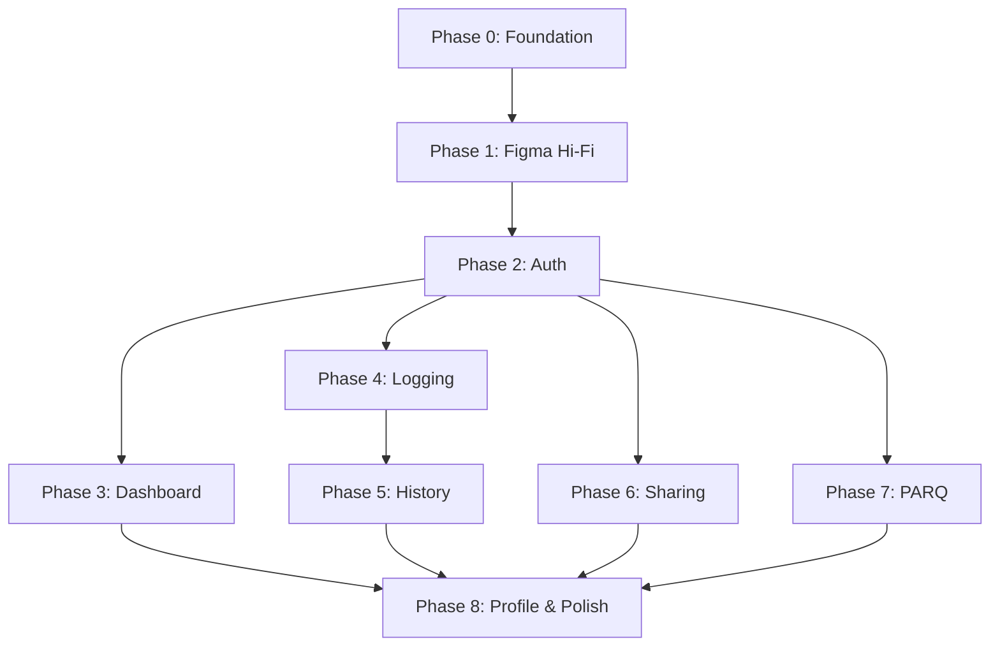

# FitOwn — Implementation Roadmap

**Scope:** Planning only — execution follows Figma hi-fi → mobile implementation  
**Total estimated phases:** 8  
**Screen count:** 20 (16 client + 4 trainer)

---

## Phase Overview

| Phase | Name | Deliverable | Depends on |
|-------|------|-------------|------------|
| 0 | Foundation | Monorepo, Supabase schema, design tokens | — |
| 1 | Figma Hi-Fi | All 20 screens + component library | Wireframe approval |
| 2 | Auth & Onboarding | Flow 1 (screens 1.1–1.3) | Phase 0, 1 |
| 3 | Dashboard | Flow 2 (screens 2.1–2.2) | Phase 2 |
| 4 | Workout Logging | Flow 3 (screens 3.1–3.4) | Phase 2 |
| 5 | History & Progress | Flow 4 (screens 4.1–4.3) | Phase 4 |
| 6 | Sharing & RBAC | Flow 5 (screens 5.1–5.3) | Phase 2 |
| 7 | PARQ | Flow 6 (screens 6.1–6.3) | Phase 2 |
| 8 | Profile & Polish | Flow 7 + QA + pilot | All |
| 9 | E2EE Messaging | Device keys + encrypted trainer chat | Phase 6 |
| 10 | Encrypted Sync | Local-first encrypted persistence + sync | Phase 4, 9 |

---

## Phase 0: Foundation (Week 1)

### Goals
- pnpm monorepo bootstrapped  
- Supabase project + migrations  
- Design token scaffold from Figma variables  
- Agent skills installed

### Tasks

- [ ] Init `pnpm-workspace.yaml`, root tooling, `@fitown/types`, `@fitown/utils`, `@fitown/constants`
- [ ] `apps/mobile` Expo project with Expo Router + NativeWind
- [ ] Supabase: profiles, exercises seed, RLS policies skeleton
- [ ] Document extraction script verified (`scripts/extract-docs.py`)
- [ ] Figma file created — link design system page

### Exit criteria
- `pnpm dev` launches Expo  
- Supabase local or hosted connects  
- Types compile across packages

---

## Phase 1: Figma Hi-Fi Design (Week 1–2)

### Goals
- Pixel-ready designs for all 20 screens  
- Component library with variants (buttons, inputs, cards, nav, toggles)  
- Gradient + colour tokens documented

### Tasks

- [ ] Apply colour direction: monochrome + teal/green accent + amber alerts
- [ ] Build component library (see `docs/planning/plans/00-design-system.md`)
- [ ] Design all Flow 1–7 screens matching wireframe IA
- [ ] Export assets (icons, logo mark "F", avatars placeholders)
- [ ] Code Connect mapping (optional, Phase 2)

### Exit criteria
- Figma file with 20 frames + component library  
- Design review with John Bower  
- `get_design_context` returns implementable specs

---

## Phase 2: Auth & Onboarding (Week 2–3)

**Plan file:** `docs/planning/plans/01-auth-onboarding.md`  
**Screens:** 1.1 Splash, 1.2 Sign Up, 1.3 Quick Profile

### Features
- Splash with Get Started / Log in CTAs
- Sign up: name, email, password, age, gender; Google SSO
- Quick profile: focus chips, experience, body weight; skippable
- Progress indicator on profile step
- Navigate to Dashboard (empty state) on complete

### Exit criteria
- New user → dashboard in <60 seconds  
- Google OAuth works on iOS + Android  
- Profile saved to Supabase

---

## Phase 3: Dashboard (Week 3)

**Plan file:** `docs/planning/plans/02-dashboard.md`  
**Screens:** 2.1 Dashboard, 2.2 Empty State

### Features
- Greeting + avatar
- Last workout card (tappable)
- Metrics: workouts this month, day streak
- Recent exercises list with inline 1RM trend (↑/—)
- FAB → Log workout
- Empty state: first workout CTA + PARQ nudge (non-blocking)
- Bottom tab navigation shell

### Exit criteria
- Populated + empty states render correctly  
- FAB routes to Log flow  
- Stats compute from real session data

---

## Phase 4: Workout Logging (Week 3–4)

**Plan file:** `docs/planning/plans/03-workout-logging.md`  
**Screens:** 3.1 Type, 3.2 Exercise, 3.3 Sets, 3.4 Cardio

### Features
- Workout type selection (strength / cardio / mixed)
- Exercise search + recent + categories
- Set entry: weight, reps, RPE with previous best + est. 1RM header
- Add set, notes, save exercise
- Cardio: activity chips, duration, intensity slider, optional distance/intervals
- 1RM auto-calculated on save

### Exit criteria
- Complete strength session logged end-to-end  
- Set entry feels <10 seconds with pre-fill  
- Cardio session saves all fields

---

## Phase 5: History & Progress (Week 4–5)

**Plan file:** `docs/planning/plans/04-history-progress.md`  
**Screens:** 4.1 History, 4.2 Exercise Detail, 4.3 Session Detail

### Features
- Weekly grouped list with filter chips (All / Strength / Cardio)
- Session detail: exercises, sets, 1RM per exercise, notes, Share + Repeat
- Exercise detail: 1RM, best load, monthly set count, progression chart, session history
- Muscle group annotation

### Exit criteria
- History reflects logged data accurately  
- Progression chart shows 8-week 1RM trend  
- Repeat pre-fills a new session

---

## Phase 6: Sharing & RBAC (Week 5–6)

**Plan file:** `docs/planning/plans/05-sharing-rbac.md`  
**Screens:** 5.1 My Team, 5.2 Access Control, 5.3 Trainer View

### Features
- My Team list: active/pending professionals
- Per-grant permission toggles (strength, cardio, PARQ, notes, body measurements)
- Invite flow: email, role chips, default permissions
- Revoke all access (destructive, confirmed)
- Trainer read-only client view with VIEW ONLY banner
- PARQ flags + muscle frequency badges (14-day)

### Exit criteria
- Client invites trainer; trainer sees permitted data only  
- Revoke removes access immediately (RLS)  
- Trainer cannot write client data

---

## Phase 7: PARQ (Week 6)

**Plan file:** `docs/planning/plans/06-parq-health.md`  
**Screens:** 6.1 Intro, 6.2 Detail, 6.3 Summary

### Features
- 7 standard PAR-Q Y/N questions
- Conditional detail expansion (chips + free text)
- Progress bar across steps
- Summary with health flags
- "Complete later" on every step
- Shared-with list on summary
- 12-month validity tracking

### Exit criteria
- Full PARQ complete + summary renders flags  
- Skippable without blocking workout log  
- Trainer view shows PARQ when permitted

---

## Phase 8: Profile & Polish (Week 6–7)

**Plan file:** `docs/planning/plans/07-profile-settings.md`  
**Screens:** 7.1 Profile, 7.2 Invite (linked from Share)

### Features
- Profile header + data summary metrics
- Links: Personal Details, PARQ, Body Measurements (stub), Data & Privacy, Export, Delete Account
- Export: JSON download/share sheet
- Delete account: confirmation + cascade
- Invite trainer (also accessible from Share tab)
- Accessibility audit (44px targets, 14px text)
- Pilot testing with John Bower persona

### Exit criteria
- Export contains all user data  
- Delete removes account + data  
- Pilot user completes real workout week in app

---

## Cross-Cutting Concerns (All Phases)

| Concern | Owner phase | Notes |
|---------|-------------|-------|
| 1RM calculation | 4 | `@fitown/utils` |
| Exercise seed DB | 0, 4 | Start with 50 movements; expand later |
| Error states | All | Network, empty, validation |
| Loading skeletons | 3+ | Match Figma shimmer if specified |
| Dark mode | Post-POC | Wireframe is light-only |
| Analytics | Post-POC | Privacy-first; opt-in only |

---

## Implementation Order Diagram



---

## Per-Module Plan Files

| File | Module |
|------|--------|
| [00-design-system.md](./plans/00-design-system.md) | Figma tokens, components, gradients |
| [01-auth-onboarding.md](./plans/01-auth-onboarding.md) | Splash, signup, quick profile |
| [02-dashboard.md](./plans/02-dashboard.md) | Home + empty state |
| [03-workout-logging.md](./plans/03-workout-logging.md) | Log flow (strength + cardio) |
| [04-history-progress.md](./plans/04-history-progress.md) | History, exercise detail, session detail |
| [05-sharing-rbac.md](./plans/05-sharing-rbac.md) | My Team, access control, trainer view |
| [06-parq-health.md](./plans/06-parq-health.md) | Health readiness form |
| [07-profile-settings.md](./plans/07-profile-settings.md) | Profile, export, delete, invite |
| [08-shared-packages.md](./plans/08-shared-packages.md) | @fitown/types, utils, constants |
| [09-database-api.md](./plans/09-database-api.md) | Supabase schema, RLS, edge functions |

---

## Document Extraction

Source documents processed by `scripts/extract-docs.py`:

| Source | Output |
|--------|--------|
| `Fit Tech - Meeting Discussion Document.pdf` | `docs/extracted/Fit Tech  - Meeting Discussion Document.txt` |
| `PARQ only 240828.pdf` | `docs/extracted/PARQ only 240828.txt` |
| `John Bower - Lenovo.docx` | `docs/extracted/John Bower  - Lenovo.txt` |
| `John Bower - Iphone.docx` | `docs/extracted/John Bower - Iphone.txt` |
| `MASGARTI's Fit Tech.html` | Wireframe (primary UI reference) |

Re-run extraction after doc updates:

```bash
python3 scripts/extract-docs.py
```

---

## Next Step After Planning

1. Review and approve this roadmap + PRODUCT.md  
2. Create Figma hi-fi file (Phase 1) using `/figma-generate-design` skill  
3. Begin Phase 0 foundation setup when implementation starts  
4. Use `/fitown-figma-mobile` skill for screen-by-screen replication
